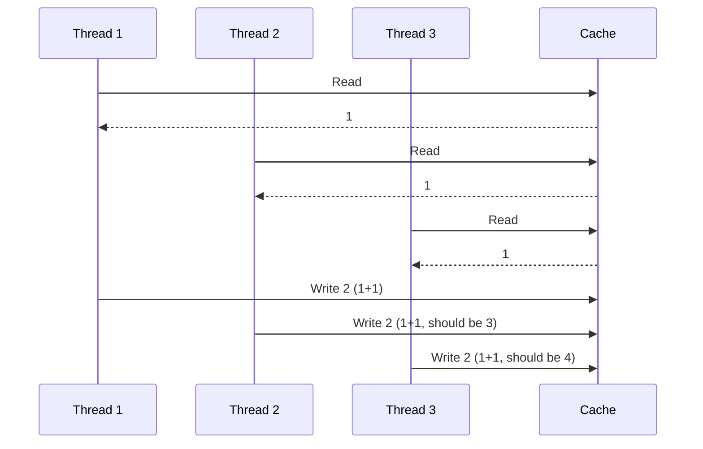

# Technical Analysis - Race Condition Challenge

## Instructions

Complete this document with your detailed technical analysis of the race condition problem and your proposed solutions.

---

## Part 1: Problem Analysis (45-60 minutes)

### 1.1 Root Cause Analysis

**Describe in detail why the race condition occurs:**

The race condition happens because the servers running the APIs can handle multiple requests concurrently. That means that in case we perform a read-modify-write in a non thread-safe manner then we will end up with race conditions and corrupted data. In that case we have a method called UpdateSegmentStatusAsync that is reading from the cache, modifying the value, and persisting the modified value without any kind of concurrency protection (like a lock).

**Create a sequence diagram or timeline showing how 3 concurrent threads cause data loss:**



**Identify all critical sections in the code:**

There are 2 critical sections in JourneyService.cs where the read-modify-write are acting:

1. UpdateSegmentStatusAsync method: 
    1. GetJourneyAsync()       → reads the full journey object from cache
    2. segment.Status = ...    → modifies a field in the in-memory object
    3. _cacheService.SetAsync()→ writes the entire journey back to cache

2. UpdateJourneyStatusAsync method:
    1. GetJourneyAsync()       → reads the full journey object from cache
    2. journey.Status = ...    → modifies the status in-memory
    3. _cacheService.SetAsync()→ writes the entire journey back to cache


**Calculate the probability of collision with N concurrent operations:**

A collision occurs when two or more threads read the same journey before any of them has written back, considering the critical time window (in our code are the 
10ms caused by the Task.Delay(10)).
To give a rough calculation of the probability of a collision, we can use an approximation from the "birthday problem" (or "birthday paradox"):

P(collision) = 1 - e^(-N²·t / T)

Where:

    N = number of concurrent threads.
    t = duration (in our case the critical time window).
    T = total time the system have been running (we can also call it observation window).

Examples:

    2 threads -> N ~ 18%
    5 threads -> N ~ 71%
    10 threads -> N ~ 99%

So we can say that with 5 thread, and given the Task.Delay(10), the probability of a collision is already more than 50%, and with 10 threads the probability is almost 100%.

### 1.2 Impact Assessment

**What are the business consequences of this race condition?**

The business consequences of the issue are that the Segments may end up with a wrong Status, and therefore decissions taken from segment status field may also be wrong. Even worst, if the data is shown to the customers, we may be giving wrong data to the customers, impacting heavily the customer experience. Also, given that this is a silent issue, in production would be hard to catch.

**Which scenarios are most likely to trigger this issue in production?**

The scenarios where the rate (req/s) is very high are the ones more likely to trigger this issue:

- Departure or arrivals during peak hours, where the statuses may be updated.
- Retries from clients for any reason
- Batching requests form the clients

**How would you detect this issue in production?**

Since the bug is silent (no errors thrown, always returns true), detection requires observability built around data consistency, and not exceptions.
This observability should be considering custom metrics, and I could think of different ways to detect:

- Custom metric checking different sources for the status (different read models or comparing with a source of truth if possible). If the statuses for the Segment mismatch, then we can raise an alert.
- That option is more a fix rather than a way to detect it, although it can be used to detect it: and that is using versioning for the updates. Each journey update stores a version field in cache, and every write increments the value. And before each update, we check the current version stored vs the expected version, and if they mismatch (current version + 1 > expected version) means that another thread updated the value in between. In that case we would raise an alert, or preferably, force that update to be retried and go through the read-modify-write again (spoiler, that optimistic approach is going to be implemented in solution 3).
- Although is not my preferred solution, another option would be to log each update with the expected value, so you can periodicly do kind of a state reconciliation.

---

## Part 2: Solution Design (90-120 minutes)

### Design 2-3 different solutions to fix this race condition

For each solution, provide:
- Detailed architecture
- Pseudocode or implementation approach
- Pros and cons
- Performance implications
- Complexity analysis

### Solution 1: First iteration - Using SemaphoreSlim

**Architecture Overview:**

A `SemaphoreSlim(1, 1)` is declared as a `static` field in `JourneyService`. Before entering the critical section (read → modify → write), each thread calls `WaitAsync()` to acquire the semaphore. Only one thread can proceed at a time and all others wait. Once the write is complete, `Release()` is called inside a `finally` block to guarantee the lock is always released, even if an exception is thrown.

**Implementation Approach:**

```csharp
private static SemaphoreSlim _semaphore = new SemaphoreSlim(1, 1);

public async Task<bool> UpdateSegmentStatusAsync(string journeyId, string segmentId, string newStatus)
{
    await _semaphore.WaitAsync();
    try
    {
        // STEP 1: Read
        var journey = await GetJourneyAsync(journeyId);
        if (journey == null) return false;

        // STEP 2: Modify
        var segment = journey.Segments.FirstOrDefault(s => s.SegmentId == segmentId);
        if (segment == null) return false;
        segment.Status = newStatus;

        // STEP 3: Write back
        var key = GetJourneyKey(journeyId);
        await _cacheService.SetAsync(key, JsonSerializer.Serialize(journey));
    }
    finally
    {
        _semaphore.Release();
    }
    return true;
}
```

**Pros:**
- Simple to implement and easy to reason about
- Correctly prevents the race condition for a single-instance deployment
- `finally` block guarantees the lock is always released

**Cons:**
- **Hard and global lock** — Two threads updating different journeys will still block each other unnecessarily, and that leads to the next point.
- Significant throughput reduction under high concurrency: the system can only process one update at a time

**Performance Impact:**
- Throughput: Severely reduced under concurrency: single-threaded for all updates
- Latency: Increases linearly while the queue grows: under high load, threads wait for all previous updates to complete
- Resource usage: Minimal... `SemaphoreSlim` is lightweight and does not allocate threads

**Edge Cases Handled:**
- Concurrent updates to the same (or different) journeys within a single process
- Exception safety: `Release()` is always called via `finally`

**Edge Cases NOT Handled:**
- Multiple API instances / horizontal scaling, the lock is not shared across processes, more relevant with distributed cache/db like Redis.
- Unnecessarily blocks updates to different journeys

---

### Solution 2: Per-key SemaphoreSlim using ConcurrentDictionary

**Architecture Overview:**

Instead of a single global semaphore, we maintain a `ConcurrentDictionary<string, SemaphoreSlim>` keyed by `journeyId`. Now each journey gets its own semaphore, so threads updating different journeys no longer block each other: only concurrent updates to the **same** journey are serialized. `GetOrAdd` ensures the semaphore is created atomically on first access.

**Implementation Approach:**

```csharp
private static readonly ConcurrentDictionary<string, SemaphoreSlim> _semaphores = new();

private SemaphoreSlim GetSemaphore(string journeyId) =>
    _semaphores.GetOrAdd(journeyId, _ => new SemaphoreSlim(1, 1));

public async Task<bool> UpdateSegmentStatusAsync(string journeyId, string segmentId, string newStatus)
{
    var semaphore = GetSemaphore(journeyId);
    await semaphore.WaitAsync();
    try
    {
        var journey = await GetJourneyAsync(journeyId);
        if (journey == null) return false;

        var segment = journey.Segments.FirstOrDefault(s => s.SegmentId == segmentId);
        if (segment == null) return false;
        segment.Status = newStatus;

        var key = GetJourneyKey(journeyId);
        await _cacheService.SetAsync(key, JsonSerializer.Serialize(journey));
    }
    finally
    {
        semaphore.Release();
    }
    return true;
}
```

**Pros:**
- Concurrent updates to **different** journeys no longer block each other, with much better throughput than Solution 1
- Still correctly serializes concurrent updates to the **same** journey
- Simple extension of Solution 1, minimal extra complexity

**Cons:**
- **Memory leak** as semaphores are added to the dictionary but never removed. Long-running services with many distinct journey IDs will accumulate entries indefinitely
- Still **not distributed-safe**, in-memory locks do not work across multiple API instances
- Cleanup logic adds complexity if addressed

**Performance Impact:**
- Throughput: Significantly better than Solution 1 as updates to independent journeys are run fully in parallel
- Latency: Only requests for the **same** journey queue behind each other, and unrelated journeys are unaffected
- Resource usage: memory increases dramatically because of adding items to the dictionary

**Edge Cases Handled:**
- Concurrent updates to the same journey are correctly serialized
- Concurrent updates to different journeys run in parallel without interference

**Edge Cases NOT Handled:**
- Multiple API instances as the dictionary is in-memory and not shared across processes (same as Solution 1)
- No cleanup of stale semaphores, so memory grows with the number of unique journey IDs

---

### Solution 3 (Optional): Optimistic Concurrency Control with Versioning

**Architecture Overview:**

Instead of locking (pessimistic), we take an optimistic approach: allow all threads to read and modify freely, but detect conflicts at write time. Each journey stored in cache includes a `Version` field. When updating, the thread reads the current version, performs its modification, and before writing back it verifies the version hasn't changed. If another thread wrote in between (version mismatch), the update is retried from the beginning.

**Implementation Approach:**

```csharp
private const int MaxRetries = 50;

public async Task<bool> UpdateSegmentStatusAsync(string journeyId, string segmentId, string newStatus)
{
    for (int attempt = 0; attempt < MaxRetries; attempt++)
    {
        // STEP 1: Read journey + its current version
        var key = GetJourneyKey(journeyId);
        var json = await _cacheService.GetAsync(key);
        if (json == null) return false;

        var journey = JsonSerializer.Deserialize<Journey>(json);
        if (journey == null) return false;

        var originalVersion = journey.Version;

        // STEP 2: Modify
        var segment = journey.Segments.FirstOrDefault(s => s.SegmentId == segmentId);
        if (segment == null) return false;
        segment.Status = newStatus;
        journey.Version++;

        // STEP 3: Conditional write — only if version still matches
        var updated = await _cacheService.CompareAndSetAsync(
            key,
            originalVersion,
            JsonSerializer.Serialize(journey));

        if (updated)
            return true;

        // Version mismatch — another thread wrote first, retry
    }
    return false; // Exhausted retries
}
```

Note: this requires adding a `Version` property to the `Journey` model and a `CompareAndSetAsync` method to `ICacheService`.

**Pros:**
- **No locks at all** with no semaphores, no memory leak, no blocking
- Under low API rate, most writes succeed on the first attempt
- Naturally **distributed-safe** as the version check happens at the cache/Redis level, so it works across multiple API instances
- This approach is widely known and used

**Cons:**
- **Big amount of retries under high  API rates**: if many threads update the same journey simultaneously, most will fail and retry, potentially amplifying load
- More complex to implement as requires changes to `ICacheService` interface and `Journey` model
- Needs a `MaxRetries` limit and a strategy for what happens when retries are exhausted
- Each retry re-reads from cache, adding extra round trips to the db/cache

**Performance Impact:**
- Throughput: Excellent under low api rate as no blocking happens. Degrades under bigger pressure on api rate due to retries
- Latency: Best-case is a single read-modify-write with no waiting. Worst-case is `MaxRetries` * full read-modify-write processing time
- Resource usage: No in-memory state to accumulate: no semaphores, no dictionaries. Trade-off is extra cache reads on retries

**Edge Cases Handled:**
- Concurrent updates to the same journey from any number of threads or instances
- Works across multiple API instances (distributed-safe)
- Naturally detects and recovers from conflicts without data loss

**Edge Cases NOT Handled:**
- High api rate scenarios may exhaust retries and fail the request
- Requires all writers to use versioning strategy. A single writer bypassing the version check breaks the guarantee

---

## Part 3: Comparative Analysis (45-60 minutes)

### 3.1 Solution Comparison

| Criteria | Solution 1 | Solution 2 | Solution 3 |
|----------|-----------|-----------|-----------|
| Complexity | Low | Medium | High |
| Performance | Poor (global bottleneck) | Good (only same-key blocks) | Best under low api rates, degrades under high rates |
| Scalability | Not scalable (single lock) | Scales well per journey | Scales horizontally (distributed-safe) |
| Reliability | High (simple, hard to get wrong) | High (same guarantees, finer granularity) | Medium (retries can be exhausted) |
| Implementation Time | ~30-60 min | ~1-2 hour | ~3-4 hours |
| Maintenance Cost | Very low | Low (potential memory leak to manage) | Medium (versioning logic, retry tuning, Lua scripts) |

### 3.2 Recommended Solution

**Which solution do you recommend for production and why?**

For a **single-instance deployment**, I recommend **Solution 2** (per-key SemaphoreSlim). It provides the best balance between simplicity and performance: it eliminates the global bottleneck of Solution 1 by allowing parallel updates to different journeys, while keeping the implementation straightforward and easy to reason about. It guarantees correctness without the retry complexity of Solution 3. Specially if there are not much concurrent updates for the same id.

**What are the trade-offs you're accepting with this choice?**

With Solution 2:
- **Memory growth**: the `ConcurrentDictionary` accumulates semaphores for every unique journey ID. For long-running services this needs to be addressed with periodic cleanup.
- **Not distributed-safe**: the in-memory locks only work within a single process. If we ever scale to multiple instances, we would need to migrate to Solution 3.
- **Same-key serialization**: concurrent updates to the same journey are processed one at a time, which under very high contention on a single journey could become a bottleneck.

---

## Part 4: Production Considerations (30-45 minutes)

### 4.1 Failure Scenarios

**What happens if Redis becomes unavailable during an update?**

If Redis goes down during an update, the `GetAsync` or `CompareAndSetAsync` calls will throw a `RedisConnectionException`. Since we are not catching that exception, it will propagate up to the controller and return a 500 to the client. This is actually the best approach: we should not silently swallow the error, because the update did not happen and the caller needs to know.

To handle this gracefully, we could:
- Wrap the calls with a try-catch at the controller/middleware level and return a proper error response (e.g., 503 Service Unavailable) with a `Retry-After` header.
- Use a circuit breaker pattern (e.g., Polly) to stop hammering Redis when it is down and fail fast instead.

**How would you handle partial failures?**

In our case, each update is a single atomic operation (either the `CompareAndSetAsync` succeeds or it doesn't), so there is no real "partial" state within a single update. The journey is either fully updated or not touched at all. There are no other I/O, so there's neither a distributed transaction.

**What's your retry strategy?**

There are two levels of retries:

1. **Application-level (optimistic concurrency)**: already implemented with `MaxRetries = 50` in Solution 3. This handles version conflicts when multiple threads update the same journey concurrently. 50 retries is generous enough to handle realistic contention.

2. **Infrastructure-level (Redis failures)**: for transient network errors or brief Redis unavailability, I would use Polly with an exponential backoff strategy (e.g., 3 retries with delays of 100ms, 500ms, 2s). If Redis is down for longer, the circuit breaker should open and fail fast.

### 4.2 Observability

**What metrics would you track?**

- **Sucessful updates**: counter for updates that returned `true` and where successfuly updated.

- **Failed updates** (exhausted retries): counter for updates that returned `false` after all retries.

- **Update latency** (p50, p95, p99): time from request to successful write (200 responses).

- **Redis connection errors**: count of `RedisConnectionException` occurrences.

- **Version mismatch**: difference between the version read and the version found at write time, to understand how much collisions are happening.

- **Memory and CPU**: monitor memory and cpu consumtion. Memory is specially critical on Scenario 2.

- **API HTTP responses**: monitor the 2xx, 4xx and 5xx to know healthiness of the API.

- **Dependency healthiness**: monitor if dependencies are healthy. In our case check that Redis is up and running.

**What alerts would you set up?**

- **High retry rate**: alert if the average retries per update exceeds a threshold (e.g., > 5), which signals high collisions.
- **Failed updates**: alert if any update exhausts all retries, as this means data was not updated and the client received a failure.
- **Redis connectivity**: alert on Redis connection errors or latency spikes (e.g., p99 > 100ms).
- **Error rate**: alert if the 5xx rate on the update endpoints exceeds a threshold (e.g., > 1%).
- **High usage of CPU/memory**: alert when CPU/memory usage is getting higher than a threshold (e.g. 80%).

**How would you debug issues in production?**

- **Logging**: log each update attempt with `journeyId`, `segmentId`, `attempt number`, `original version`, and `success/failure`. This allows tracing the full retry history of a specific update.
- **Correlation IDs**: propagate a request ID through all log entries so you can follow a single request across retries.
- **Redis monitoring**: if Redis is the bottleneck, use the built-in monitoring to check what is going on.
- **Dashboards**: a Grafana dashboard showing the metrics mentioned above would be very useful to know what is going on in the system.

### 4.3 Deployment Strategy

**How would you roll out this fix to production?**

There are different deployment strategies we can use to safely roll out this change. Each of them gives you a strategy to rollback in case the fix is not behaving as expected:

1. **Feature flag**: deploy the new code behind a feature flag so we can switch between the old (broken) behavior and the new (fixed) behavior without redeploying.
2. **Canary deployment**: route a small percentage of traffic (e.g., 5%) to the new version and monitor metrics (retry rates, error rates, latency) for anomalies. We can do that using a LB/service layer on our infrastructure.
3. **Gradual rollout**: related to the previous one, if canary looks healthy, progressively increase traffic (25% → 50% → 100%) over a few hours or days.

Note: in case we use Solution 3 we need to ensure all existing journeys in cache have a `Version` field. The `InitializeCacheAsync` method already sets `Version = 0`, but for any journeys already in cache we should run a one-time migration script to add the field.

**What's your rollback plan if issues arise?**

- **Feature flag off**: if the fix introduces unexpected behavior, toggle the feature flag to revert to the previous implementation immediately, without needing a new deployment.
- **Canary deployment**: switch all the traffic to the old version, and revert the new instance to the previous Docker image / deployment artifact.
- **Cache corrupted**: if the data in cache is corrupted (e.g., wrong version numbers), flush the affected keys and let the system re-initialize.

**How would you validate the fix in production?**

- **Run the concurrent update test** against a staging environment with production-like data and traffic.
- **Monitor retry metrics**: after deployment, verify that retries are happening as expected (low retry count under normal load, no exhausted retries).
- **Data consistency check**: compare segment statuses in cache against the source of truth (database) periodically to ensure no updates are being lost.
- **Synthetic tests**: schedule a periodic job that performs concurrent updates to a test journey and verifies all updates are applied correctly.

### 4.4 Testing Strategy

**What additional tests would you add beyond the existing ones?**

- **Unit tests for `CompareAndSetAsync`**: for Solution 3, verify that it correctly rejects writes when the version doesn't match, and accepts writes when it does.
- **Performance tests**: test with 5, 20, 50, and 100 concurrent threads to validate behavior under different loads.
- **Retry exhaustion test**: simulate an extreme condition (e.g., artifical big delays) to verify the system behaves correctly when `MaxRetries` is exhausted.
- **Integration/end-to-end tests**: with integration tests we can spin up an instance of the api, hit the endpoints, and check that the integration with Redis works fine.
- **End-to-end tests**: with this test we can simulate real user flows and check that API and Redis are properly working. As the system is too small and we only have Redis, those tests right now would be very similar to the integration testing.


**How would you test this under realistic production load?**

- **Load testing with k6, JMeter, Gatling, etc.**: simulate realistic traffic patterns (mix of reads and writes, multiple journeys, etc.) against a staging (or any other very-close to reality) environment connected to a real Redis instance. If any, I would use existing metrics to simulate real loads.
- **Chaos testing**: use tools like Chaos Monkey or Toxiproxy to introduce Redis latency, connection drops, and timeouts during load tests to validate resilience.
- **Soak testing**: run the load test for an extended period (e.g., 24 hours) to detect memory leaks (especially relevant for Solution 2) and performance degradation over time.

---

## Part 5: Implementation Plan (15-30 minutes)

### 5.1 Steps to Implement Your Chosen Solution

1. [Step 1]
2. [Step 2]
3. [Step 3]
...

### 5.2 Estimated Implementation Time

**Total time to implement:** [Your estimate]

**Breakdown:**
- Core implementation: [Time]
- Tests: [Time]
- Documentation: [Time]
- Code review cycles: [Time]

---

## Final Notes

**Any additional observations or considerations:**

[Your notes here]
