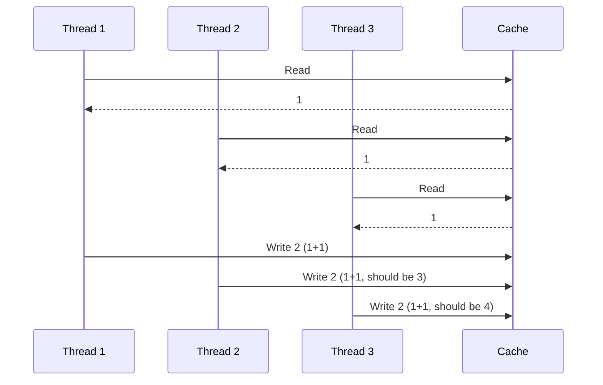

# Technical Analysis - Race Condition Challenge

## Instructions

Complete this document with your detailed technical analysis of the race condition problem and your proposed solutions.

---

## Part 1: Problem Analysis (45-60 minutes)

### 1.1 Root Cause Analysis

**Describe in detail why the race condition occurs:**

The race condition happens because the servers running the APIs can handle multiple requests concurrently. That means that in case we perform a read-modify-write in a non thread-safe manner then we will end up with race conditions and corrupted data. In that case we have a method called UpdateSegmentStatusAsync that is reading from the cache, modifying the value, and persisting the modified value without any kind of concurrency protection (like a lock).

**Create a sequence diagram or timeline showing how 3 concurrent threads cause data loss:**



**Identify all critical sections in the code:**

There are 2 critical sections in JourneyService.cs where the read-modify-write are acting:

1. UpdateSegmentStatusAsync method: 
    1. GetJourneyAsync()       → reads the full journey object from cache
    2. segment.Status = ...    → modifies a field in the in-memory object
    3. _cacheService.SetAsync()→ writes the entire journey back to cache

2. UpdateJourneyStatusAsync method:
    1. GetJourneyAsync()       → reads the full journey object from cache
    2. journey.Status = ...    → modifies the status in-memory
    3. _cacheService.SetAsync()→ writes the entire journey back to cache


**Calculate the probability of collision with N concurrent operations:**

A collision occurs when two or more threads read the same journey before any of them has written back, considering the critical time window (in our code are the 
10ms caused by the Task.Delay(10)).
To give a rough calculation of the probability of a collision, we can use an approximation from the "birthday problem" (or "birthday paradox"):

P(collision) = 1 - e^(-N²·t / T)

Where:

    N = number of concurrent threads.
    t = duration (in our case the critical time window).
    T = total time the system have been running (we can also call it observation window).

Examples:

    2 threads -> N ~ 18%
    5 threads -> N ~ 71%
    10 threads -> N ~ 99%

So we can say that with 5 thread, and given the Task.Delay(10), the probability of a collision is already more than 50%, and with 10 threads the probability is almost 100%.

### 1.2 Impact Assessment

**What are the business consequences of this race condition?**

The business consequences of the issue are that the Segments may end up with a wrong Status, and therefore decissions taken from segment status field may also be wrong. Even worst, if the data is shown to the customers, we may be giving wrong data to the customers, impacting heavily the customer experience. Also, given that this is a silent issue, in production would be hard to catch.

**Which scenarios are most likely to trigger this issue in production?**

The scenarios where the rate (req/s) is very high are the ones more likely to trigger this issue:

- Departure or arrivals during peak hours, where the statuses may be updated.
- Retries from clients for any reason
- Batching requests form the clients

**How would you detect this issue in production?**

Since the bug is silent (no errors thrown, always returns true), detection requires observability built around data consistency, and not exceptions.
This observability should be considering custom metrics, and I could think of different ways to detect:

- Custom metric checking different sources for the status (different read models or comparing with a source of truth if possible). If the statuses for the Segment mismatch, then we can raise an alert.
- That option is more a fix rather than a way to detect it, although it can be used to detect it: and that is using versioning for the updates. Each journey update stores a version field in cache, and every write increments the value. And before each update, we check the current version stored vs the expected version, and if they mismatch (current version + 1 > expected version) means that another thread updated the value in between. In that case we would raise an alert, or preferably, force that update to be retried and go through the read-modify-write again (spoiler, that optimistic approach is going to be implemented in solution 3).
- Although is not my preferred solution, another option would be to log each update with the expected value, so you can periodicly do kind of a state reconciliation.

---

## Part 2: Solution Design (90-120 minutes)

### Design 2-3 different solutions to fix this race condition

For each solution, provide:
- Detailed architecture
- Pseudocode or implementation approach
- Pros and cons
- Performance implications
- Complexity analysis

### Solution 1: First iteration - Using SemaphoreSlim

**Architecture Overview:**

A `SemaphoreSlim(1, 1)` is declared as a `static` field in `JourneyService`. Before entering the critical section (read → modify → write), each thread calls `WaitAsync()` to acquire the semaphore. Only one thread can proceed at a time and all others wait. Once the write is complete, `Release()` is called inside a `finally` block to guarantee the lock is always released, even if an exception is thrown.

**Implementation Approach:**

```csharp
private static SemaphoreSlim _semaphore = new SemaphoreSlim(1, 1);

public async Task<bool> UpdateSegmentStatusAsync(string journeyId, string segmentId, string newStatus)
{
    await _semaphore.WaitAsync();
    try
    {
        // STEP 1: Read
        var journey = await GetJourneyAsync(journeyId);
        if (journey == null) return false;

        // STEP 2: Modify
        var segment = journey.Segments.FirstOrDefault(s => s.SegmentId == segmentId);
        if (segment == null) return false;
        segment.Status = newStatus;

        // STEP 3: Write back
        var key = GetJourneyKey(journeyId);
        await _cacheService.SetAsync(key, JsonSerializer.Serialize(journey));
    }
    finally
    {
        _semaphore.Release();
    }
    return true;
}
```

**Pros:**
- Simple to implement and easy to reason about
- Correctly prevents the race condition for a single-instance deployment
- `finally` block guarantees the lock is always released

**Cons:**
- **Hard and global lock** — Two threads updating different journeys will still block each other unnecessarily, and that leads to the next point.
- Significant throughput reduction under high concurrency: the system can only process one update at a time

**Performance Impact:**
- Throughput: Severely reduced under concurrency: single-threaded for all updates
- Latency: Increases linearly while the queue grows: under high load, threads wait for all previous updates to complete
- Resource usage: Minimal... `SemaphoreSlim` is lightweight and does not allocate threads

**Edge Cases Handled:**
- Concurrent updates to the same (or different) journeys within a single process
- Exception safety: `Release()` is always called via `finally`

**Edge Cases NOT Handled:**
- Multiple API instances / horizontal scaling, the lock is not shared across processes, more relevant with distributed cache/db like Redis.
- Unnecessarily blocks updates to different journeys

---

### Solution 2: Per-key SemaphoreSlim using ConcurrentDictionary

**Architecture Overview:**

Instead of a single global semaphore, we maintain a `ConcurrentDictionary<string, SemaphoreSlim>` keyed by `journeyId`. Now each journey gets its own semaphore, so threads updating different journeys no longer block each other: only concurrent updates to the **same** journey are serialized. `GetOrAdd` ensures the semaphore is created atomically on first access.

**Implementation Approach:**

```csharp
private static readonly ConcurrentDictionary<string, SemaphoreSlim> _semaphores = new();

private SemaphoreSlim GetSemaphore(string journeyId) =>
    _semaphores.GetOrAdd(journeyId, _ => new SemaphoreSlim(1, 1));

public async Task<bool> UpdateSegmentStatusAsync(string journeyId, string segmentId, string newStatus)
{
    var semaphore = GetSemaphore(journeyId);
    await semaphore.WaitAsync();
    try
    {
        var journey = await GetJourneyAsync(journeyId);
        if (journey == null) return false;

        var segment = journey.Segments.FirstOrDefault(s => s.SegmentId == segmentId);
        if (segment == null) return false;
        segment.Status = newStatus;

        var key = GetJourneyKey(journeyId);
        await _cacheService.SetAsync(key, JsonSerializer.Serialize(journey));
    }
    finally
    {
        semaphore.Release();
    }
    return true;
}
```

**Pros:**
- Concurrent updates to **different** journeys no longer block each other, with much better throughput than Solution 1
- Still correctly serializes concurrent updates to the **same** journey
- Simple extension of Solution 1, minimal extra complexity

**Cons:**
- **Memory leak** as semaphores are added to the dictionary but never removed. Long-running services with many distinct journey IDs will accumulate entries indefinitely
- Still **not distributed-safe**, in-memory locks do not work across multiple API instances
- Cleanup logic adds complexity if addressed

**Performance Impact:**
- Throughput: Significantly better than Solution 1 as updates to independent journeys are run fully in parallel
- Latency: Only requests for the **same** journey queue behind each other, and unrelated journeys are unaffected
- Resource usage: memory increases dramatically because of adding items to the dictionary

**Edge Cases Handled:**
- Concurrent updates to the same journey are correctly serialized
- Concurrent updates to different journeys run in parallel without interference

**Edge Cases NOT Handled:**
- Multiple API instances as the dictionary is in-memory and not shared across processes (same as Solution 1)
- No cleanup of stale semaphores, so memory grows with the number of unique journey IDs

---

### Solution 3 (Optional): [Name your approach]

**Architecture Overview:**

[Your description here]

**Implementation Approach:**

``csharp
// Pseudocode or key code snippets
``

**Pros:**
- [List advantages]

**Cons:**
- [List disadvantages]

**Performance Impact:**
- Throughput: [Your analysis]
- Latency: [Your analysis]
- Resource usage: [Your analysis]

**Edge Cases Handled:**
- [List edge cases this solution handles]

**Edge Cases NOT Handled:**
- [List limitations]

---

## Part 3: Comparative Analysis (45-60 minutes)

### 3.1 Solution Comparison

| Criteria | Solution 1 | Solution 2 | Solution 3 |
|----------|-----------|-----------|-----------|
| Complexity | [Your rating] | [Your rating] | [Your rating] |
| Performance | [Your rating] | [Your rating] | [Your rating] |
| Scalability | [Your rating] | [Your rating] | [Your rating] |
| Reliability | [Your rating] | [Your rating] | [Your rating] |
| Implementation Time | [Your estimate] | [Your estimate] | [Your estimate] |
| Maintenance Cost | [Your estimate] | [Your estimate] | [Your estimate] |

### 3.2 Recommended Solution

**Which solution do you recommend for production and why?**

[Your detailed recommendation here]

**What are the trade-offs you're accepting with this choice?**

[Your answer here]

---

## Part 4: Production Considerations (30-45 minutes)

### 4.1 Failure Scenarios

**What happens if Redis becomes unavailable during an update?**

[Your answer here]

**How would you handle partial failures?**

[Your answer here]

**What's your retry strategy?**

[Your answer here]

### 4.2 Observability

**What metrics would you track?**

[Your answer here]

**What alerts would you set up?**

[Your answer here]

**How would you debug issues in production?**

[Your answer here]

### 4.3 Deployment Strategy

**How would you roll out this fix to production?**

[Your answer here]

**What's your rollback plan if issues arise?**

[Your answer here]

**How would you validate the fix in production?**

[Your answer here]

### 4.4 Testing Strategy

**What additional tests would you add beyond the existing ones?**

[Your answer here]

**How would you test this under realistic production load?**

[Your answer here]

---

## Part 5: Implementation Plan (15-30 minutes)

### 5.1 Steps to Implement Your Chosen Solution

1. [Step 1]
2. [Step 2]
3. [Step 3]
...

### 5.2 Estimated Implementation Time

**Total time to implement:** [Your estimate]

**Breakdown:**
- Core implementation: [Time]
- Tests: [Time]
- Documentation: [Time]
- Code review cycles: [Time]

---

## Final Notes

**Any additional observations or considerations:**

[Your notes here]
